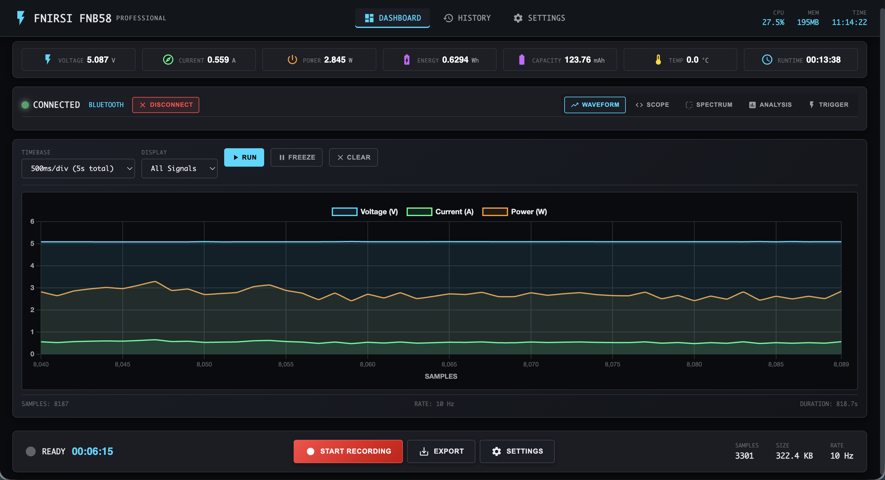
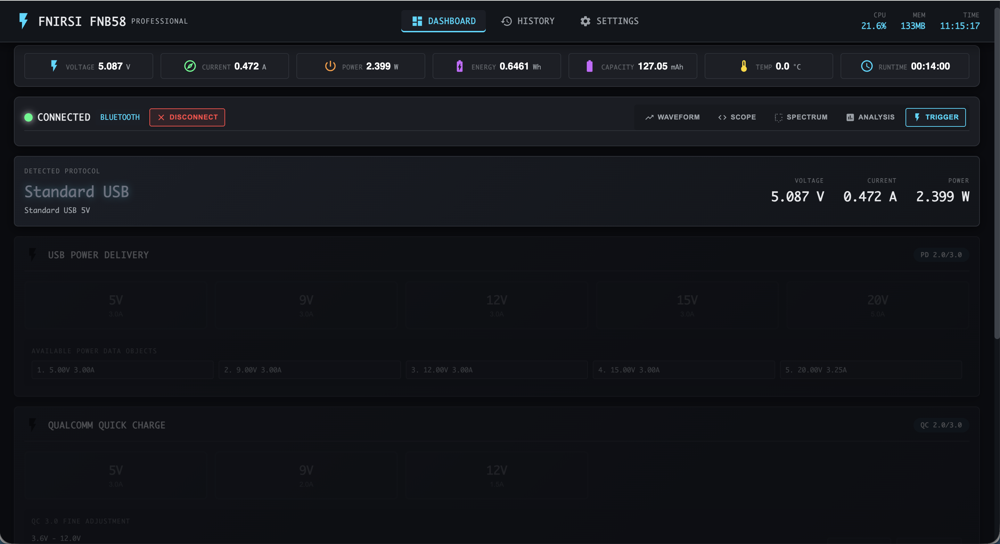
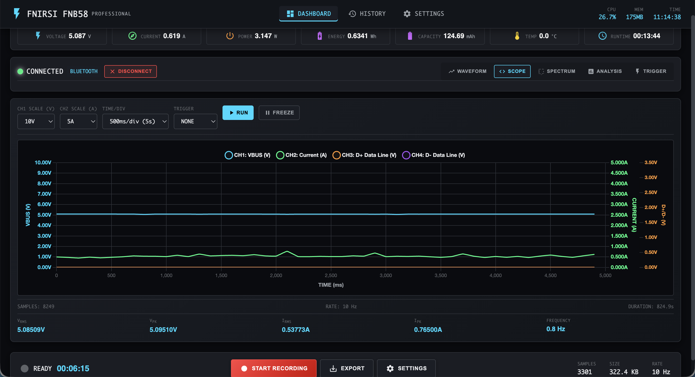
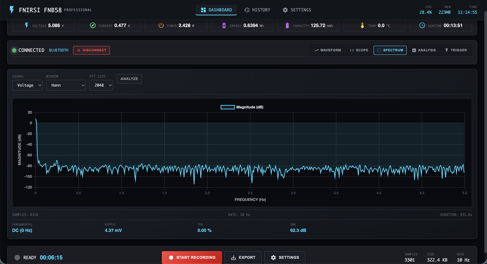
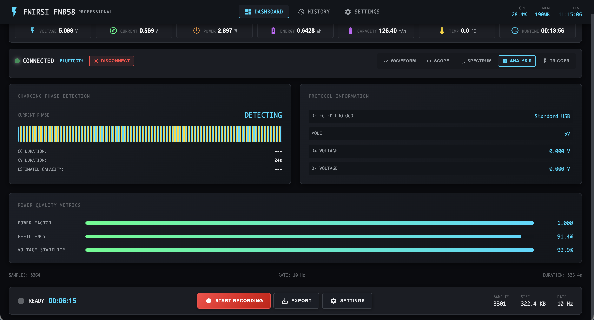
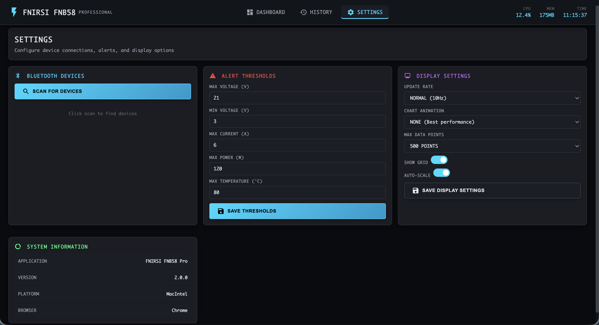
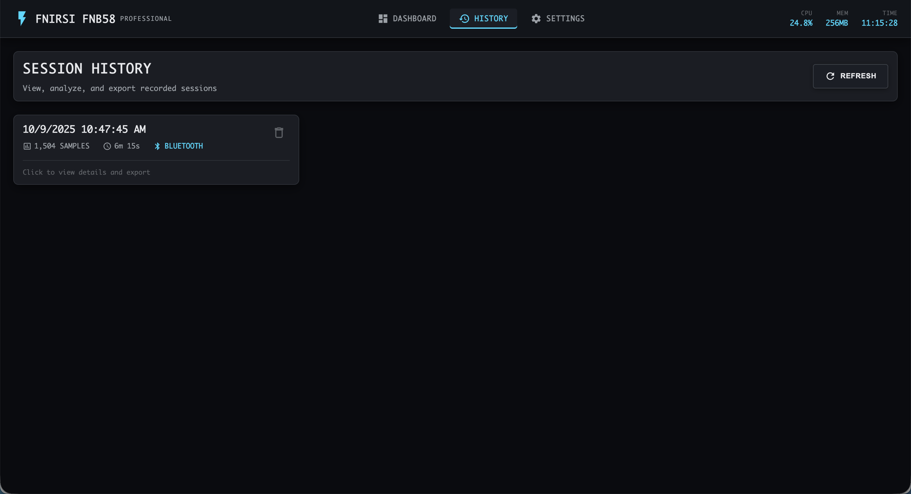

# FNIRSI FNB58 Web Monitor

🚀 **A beautiful, feature-rich web application for monitoring your FNIRSI FNB58 USB Power Meter**

Monitor voltage, current, power, and more in real-time through your web browser. Supports both USB and Bluetooth connectivity!


## 📸 Screenshots

### Dashboard - Real-Time Monitoring

*Live voltage, current, and power tracking with interactive charts*

### Oscilloscope & Protocol Analysis
<table>
  <tr>
    <td width="50%">
      
      <p align="center"><em>Trigger modes for protocol analysis</em></p>
    </td>
    <td width="50%">
      
      <p align="center"><em>D+/D- waveform oscilloscope</em></p>
    </td>
  </tr>
</table>

### Advanced Analysis
<table>
  <tr>
    <td width="50%">
      
      <p align="center"><em>FFT spectrum analyzer</em></p>
    </td>
    <td width="50%">
      
      <p align="center"><em>Detailed statistics and metrics</em></p>
    </td>
  </tr>
</table>

### Settings & History
<table>
  <tr>
    <td width="50%">
      
      <p align="center"><em>Bluetooth scanner and device settings</em></p>
    </td>
    <td width="50%">
      
      <p align="center"><em>Record and review monitoring sessions</em></p>
    </td>
  </tr>
</table>

## ✨ Features

### Core Functionality
- ⚡ **Real-time Monitoring** - Live voltage, current, and power readings
- 📊 **Beautiful Charts** - Interactive Chart.js graphs with zoom and pan
- 🔌 **Dual-Mode Support** - Connect via USB or Bluetooth
- 📱 **Mobile-First** - PWA ready, works great on phones and tablets
- 🌙 **Dark Theme** - Easy on the eyes, professional look

### Data Management
- 📝 **Session Recording** - Start/stop recording with statistics
- 💾 **Export Options** - Export to CSV or JSON
- 📈 **Session History** - View and analyze past sessions
- 📊 **Statistics** - Min/max/avg calculations, energy & capacity tracking

### Advanced Features
- 🔵 **Bluetooth Support** - Wireless monitoring from any device
- 🌐 **WebSocket Updates** - Real-time data streaming
- 📱 **Progressive Web App** - Install on home screen
- 🎨 **Responsive Design** - Works on desktop, tablet, and mobile

## 🚀 Quick Start

**Two ways to run:**
1. **🐳 Docker** (Recommended) - Easy deployment, no dependencies
2. **🐍 Python** - Native installation

### Option 1: Docker (Recommended)

```bash
# Using Docker Compose
docker-compose up -d

# Or using Docker CLI
docker run -d -p 5000:5000 \
  --device=/dev/bus/usb:/dev/bus/usb \
  --privileged \
  fnb58-monitor
```

**➡️ See [DOCKER.md](DOCKER.md) for complete Docker documentation**

### Option 2: Python Installation

#### Prerequisites

- Python 3.8 or higher
- FNIRSI FNB58 USB Power Meter
- macOS, Linux, or Windows

#### Installation

1. **Clone the repository**
```bash
git clone https://github.com/RedThoroughbred/FNB58-MacOS.git
cd FNB58-MacOS
```

2. **Create and activate virtual environment** (recommended)
```bash
# Create virtual environment
python3 -m venv venv

# Activate it
# macOS/Linux:
source venv/bin/activate

# Windows:
venv\Scripts\activate
```

3. **Install Python dependencies**
```bash
pip install -r requirements.txt
```

4. **For USB support on macOS/Linux**, you may need libusb:
```bash
# macOS
brew install libusb

# Ubuntu/Debian
sudo apt-get install libusb-1.0-0-dev

# Fedora
sudo dnf install libusb-devel
```

5. **Run the application**
```bash
python start.py
```

6. **Open your browser**
```
http://localhost:5001
```

## 📖 Usage

### Connecting Your Device

1. **Plug in your FNIRSI FNB58** via USB or turn on Bluetooth
2. **Click "Connect (Auto)"** on the dashboard
   - Auto mode will try Bluetooth first, then USB
   - Or manually select USB or Bluetooth
3. **Start monitoring!** Data will stream in real-time

### Recording a Session

1. **Connect your device** (if not already connected)
2. **Click "Start Recording"**
3. **Perform your test** (charge phone, test power bank, etc.)
4. **Click "Stop Recording"**
5. **Export or view** the session in History

### Viewing History

1. Navigate to **History** page
2. Click on any **session** to view details
3. View **charts and statistics**
4. **Export** to CSV or JSON

## 🔧 Configuration

### Bluetooth Setup

If you have the Bluetooth version of FNB58:

1. Go to **Settings** page
2. Click **"Scan for Bluetooth Devices"**
3. Select your **FNB58** from the list
4. **Save** the MAC address

The app will remember your device and auto-connect next time!

### USB Permissions (Linux)

On Linux, you may need to set up udev rules:

```bash
# Create udev rule
sudo tee /etc/udev/rules.d/90-fnirsi.rules << EOF
SUBSYSTEM=="usb", ATTRS{idVendor}=="0716", MODE="0666"
EOF

# Reload rules
sudo udevadm control --reload-rules
sudo udevadm trigger
```

## 📊 Features in Detail

### Real-Time Monitoring
- **100Hz sampling rate** (USB mode)
- **10Hz sampling rate** (Bluetooth mode)
- **Live charts** with automatic scaling
- **Min/max tracking** for all metrics
- **D+/D- voltages** for protocol analysis
- **Temperature monitoring**

### Data Export
- **CSV format** - Compatible with Excel, Python, R
- **JSON format** - Full session data with metadata
- **Timestamps** - ISO 8601 format for easy parsing

### Session Statistics
- **Energy consumption** (Wh)
- **Capacity** (Ah/mAh)
- **Min/Max/Average** for all metrics
- **Sample count** and duration

## 🛠️ Development

### Project Structure
```
fnirsi-web-monitor/
├── app.py                 # Main Flask application
├── config.py              # Configuration
├── requirements.txt       # Python dependencies
├── device/                # Device communication
│   ├── usb_reader.py      # USB HID communication
│   ├── bluetooth_reader.py # Bluetooth LE communication
│   ├── device_manager.py  # Connection management
│   └── data_processor.py  # Data analysis
├── static/                # Frontend assets
│   ├── css/
│   ├── js/
│   └── manifest.json      # PWA manifest
└── templates/             # HTML templates
    ├── base.html
    ├── dashboard.html
    ├── settings.html
    └── history.html
```

### API Endpoints

- `GET  /api/status` - Connection status
- `POST /api/connect` - Connect to device
- `POST /api/disconnect` - Disconnect
- `GET  /api/reading/latest` - Latest reading
- `GET  /api/reading/recent` - Recent data points
- `GET  /api/stats` - Current statistics
- `POST /api/recording/start` - Start recording
- `POST /api/recording/stop` - Stop recording
- `GET  /api/sessions` - List saved sessions
- `GET  /api/sessions/:id` - Get specific session
- `GET  /api/scan-bluetooth` - Scan for Bluetooth devices

### WebSocket Events

- `connect` - Client connected
- `disconnect` - Client disconnected
- `new_reading` - New data from device
- `request_data` - Request historical data

## 🤝 Contributing

Contributions are welcome! This project is designed to be:

- **Easy to understand** - Clear code with comments
- **Easy to extend** - Modular architecture
- **Easy to deploy** - Minimal dependencies

### Ideas for Contributions

- 📱 iOS/Android native apps
- 🔋 Battery testing presets
- 📊 More chart types (heatmaps, 3D, etc.)
- 🌍 Multi-language support
- 🔔 Push notifications
- 📧 Email alerts
- 🗄️ Database support (PostgreSQL, etc.)

## 🐛 Troubleshooting

### Device not detected (USB)
- Check USB cable is data-capable (not charge-only)
- Try a different USB port
- Check udev rules (Linux)
- Run with sudo (temporary test)

### Bluetooth connection fails
- Ensure device is in range
- Check Bluetooth is enabled on computer
- Pair device in OS Bluetooth settings first
- Scan for devices in Settings page

### Charts not updating
- Check WebSocket connection in browser console
- Refresh the page
- Check if device is connected
- Clear browser cache

### Permission errors
- Run with appropriate permissions
- Set up udev rules (Linux)
- Check firewall settings

## 📝 License

MIT License - feel free to use, modify, and distribute!

## 🙏 Acknowledgments

- **baryluk** - USB protocol reverse engineering ([fnirsi-usb-power-data-logger](https://github.com/baryluk/fnirsi-usb-power-data-logger))
- **parkerlreed** - Bluetooth protocol reverse engineering
- **FNIRSI** - For making awesome test equipment

## 📧 Support

Found a bug? Have a feature request? Open an issue!

Want to show off your setup? Share screenshots!

---

**Made with ⚡ for the FNIRSI FNB58 community**
